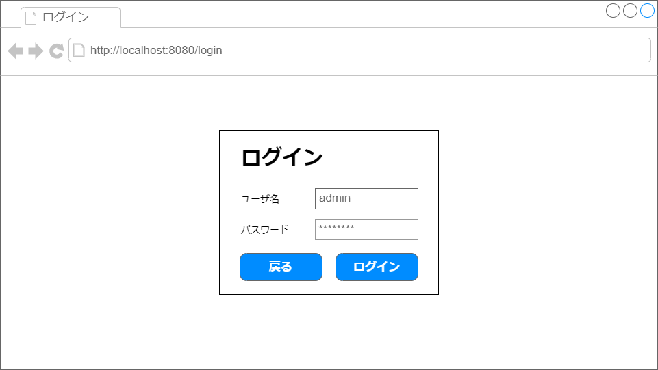
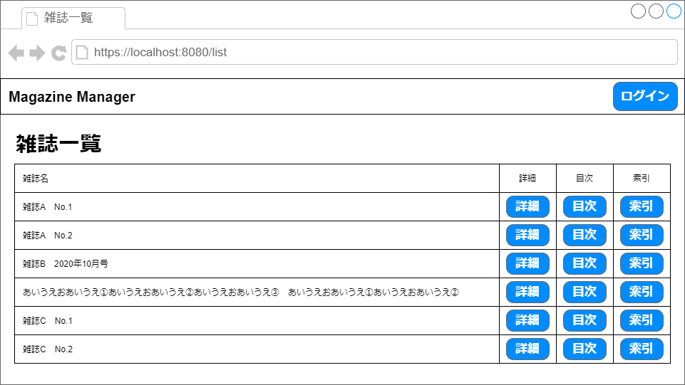
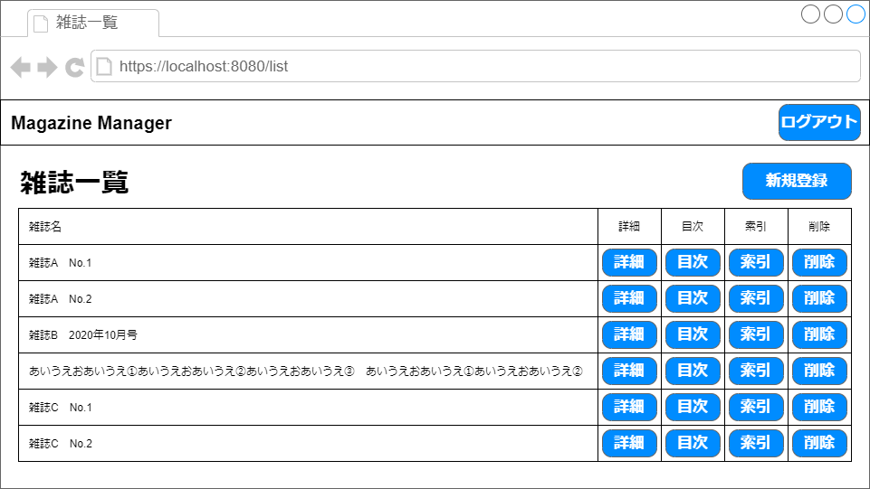
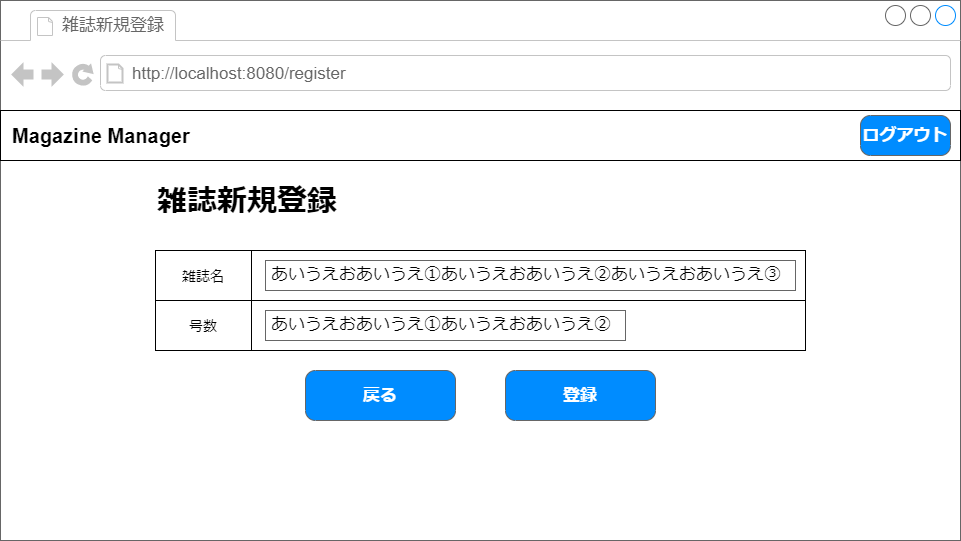
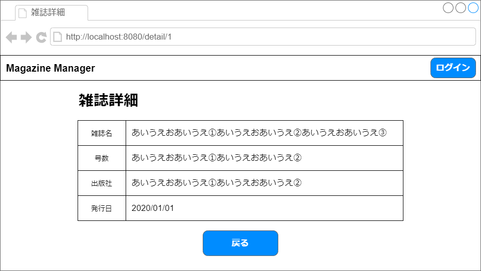
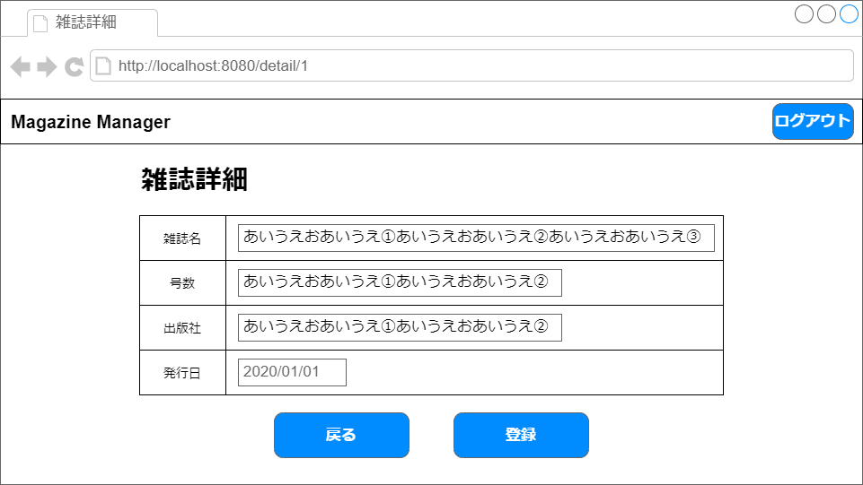
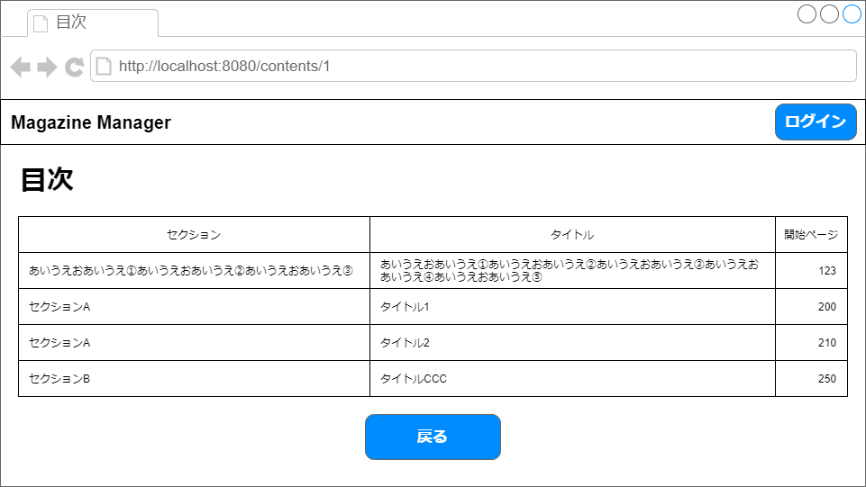
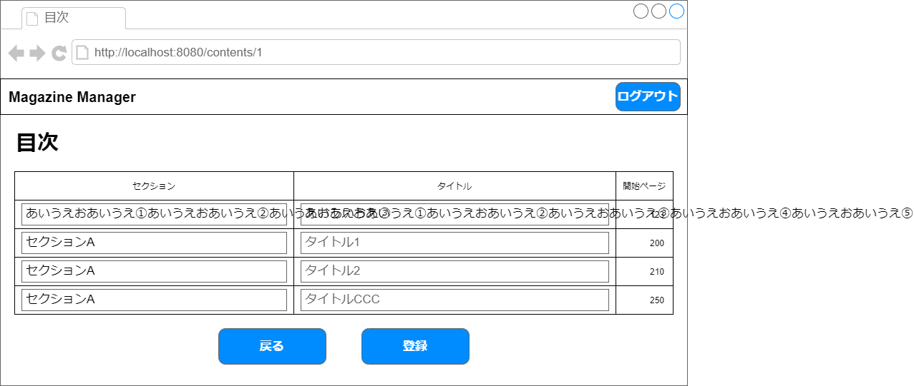
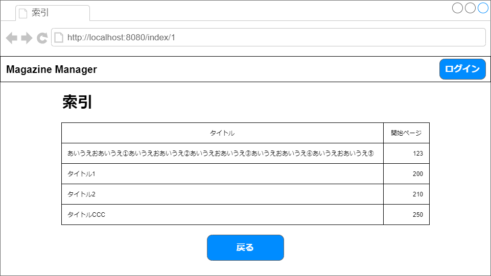
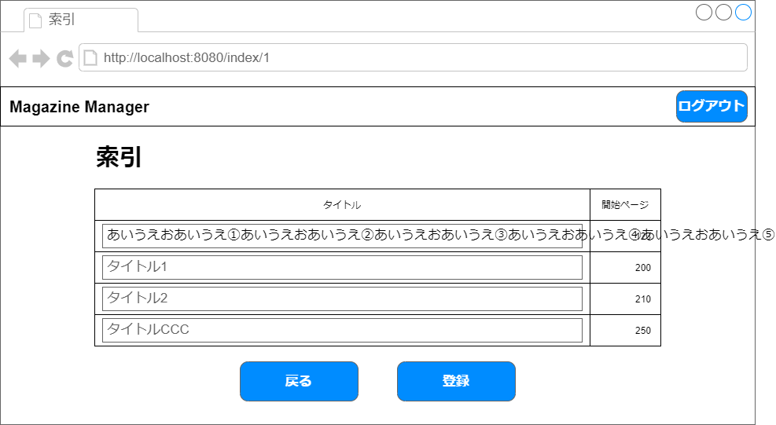

# ワイヤーフレーム一覧

> ワイヤーフレームの作成では、画面全体の大まかなレイアウトを決める。  
> 文字のサイズやボタンの色など、詳細なデザインについてはモックアップ作成時に考える。

## ログイン画面

## 雑誌一覧画面
### 匿名ユーザの場合

### 管理者ユーザの場合

## 雑誌新規登録画面

## 雑誌詳細画面
### 匿名ユーザの場合

### 管理者ユーザの場合

## 目次画面
### 匿名ユーザの場合

### 管理者ユーザの場合

## 索引画面
### 匿名ユーザの場合

### 管理者ユーザの場合

